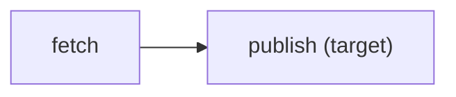

# `kazeflow plan`

Resolve a flow and render its selected dependency plan without invoking asset bodies
after the entry has loaded.

## Synopsis

```console
kazeflow plan ENTRY \
  [--target NAME ...] \
  [--partition-key KEY ... | --partition-range START END | --empty-partitions] \
  [--max-concurrency N] [--verbose] \
  [--format text|json|mermaid|dot]
```

## Selection options

| Option | Meaning |
| --- | --- |
| `--target NAME` | Select a target; repeat for several targets. |
| `--partition-key KEY`, `--partition KEY` | Select one key; repeat as needed. The selected definition normalizes or rejects each key. |
| `--partition-range START END` | Select one inclusive bounded range when the selected definition supports ranges. |
| `--empty-partitions` | Deliberately select no partition attempts. |
| `--max-concurrency N` | Review a positive normalized execution concurrency. |
| `--verbose` | Add task/configuration detail to text output only. |

Partition selectors are mutually exclusive. A partitioned closure requires exactly
one selection form; omitting one is a preflight configuration error. Passing any
selector to an unpartitioned closure is a usage error. Neither case invokes an asset
body.

## Graph formats

```console
kazeflow plan daily.py
kazeflow plan daily.py --format mermaid
kazeflow plan daily.py --format dot > flow.dot
```

Mermaid output is directly pasteable into compatible Markdown:



kazeflow emits graph source but does not install or invoke Mermaid or Graphviz.

## JSON boundary

The JSON plan projection is deterministic and intentionally lossy. It reports the
selection kind, stable domain, and safe counts rather than serializing arbitrary raw
partition keys. Text, JSON, Mermaid, and DOT plans preserve this no-raw-key boundary.
Use JSON instead of parsing text whitespace.
