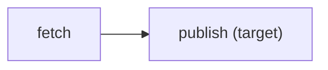

# `kazeflow plan`

Resolve a flow and render its selected dependency plan without invoking asset bodies
after the entry has loaded.

## Synopsis

```console
kazeflow plan ENTRY \
  [--target NAME ...] [--partition-key KEY ...] \
  [--max-concurrency N] [--verbose] \
  [--format text|json|mermaid|dot]
```

## Selection options

| Option | Meaning |
| --- | --- |
| `--target NAME` | Select a target; repeat for several targets. |
| `--partition-key KEY`, `--partition KEY` | Select a textual partition key; repeat as needed. |
| `--max-concurrency N` | Review a positive normalized execution concurrency. |
| `--verbose` | Add task/configuration detail to text output only. |

## Graph formats

```console
kazeflow plan daily.py
kazeflow plan daily.py --format mermaid
kazeflow plan daily.py --format dot > flow.dot
```

Mermaid output is directly pasteable into compatible Markdown:



kazeflow emits graph source but does not install or invoke Mermaid or Graphviz.

## JSON boundary

The JSON plan projection is deterministic and intentionally lossy. It reports
partition presence/count rather than serializing arbitrary raw partition keys. Use
JSON instead of parsing text whitespace.
